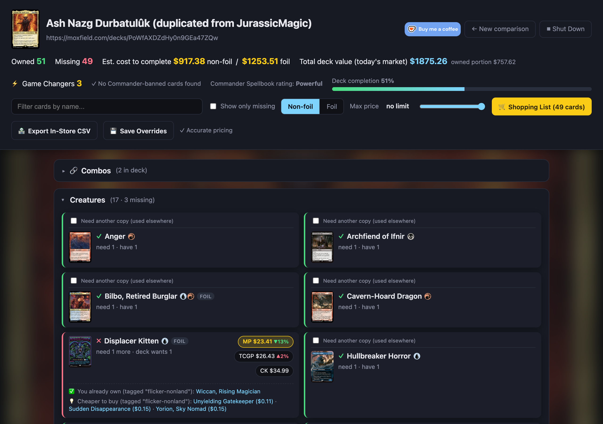
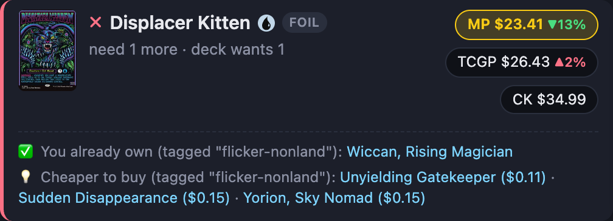
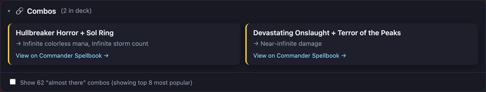
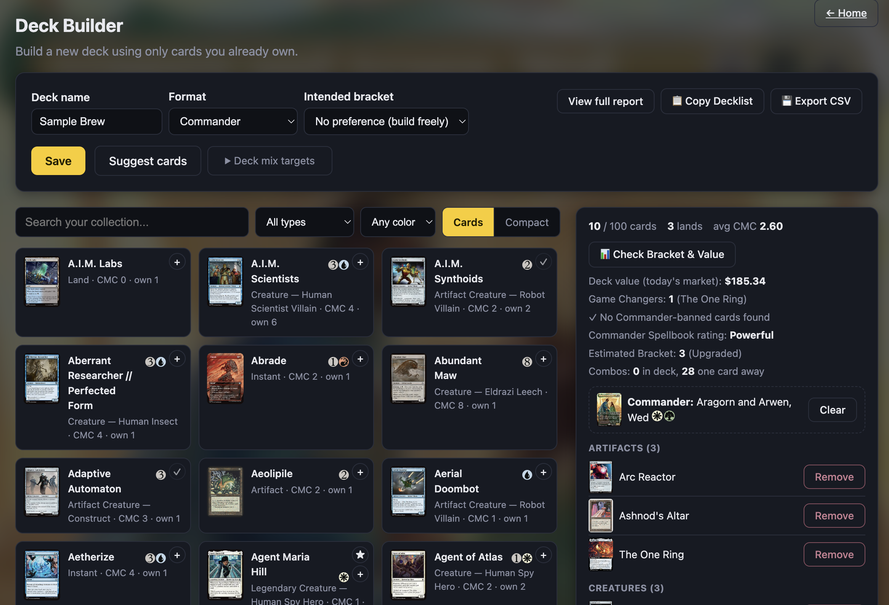
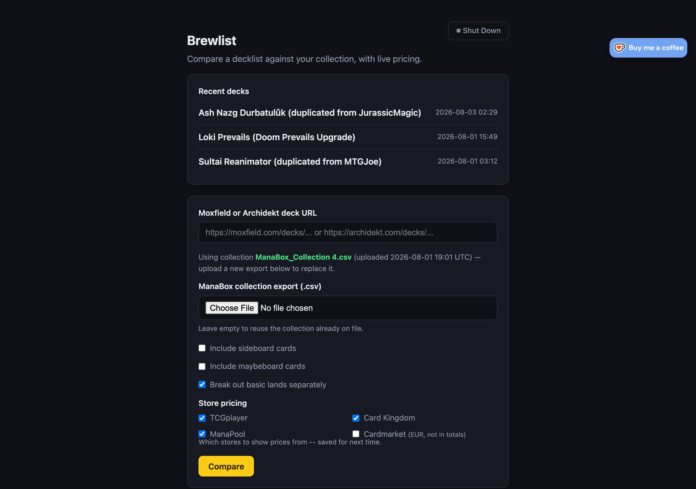

# Brewlist

<p align="center">
  <a href="https://ko-fi.com/imtotallymeh"></a>
</p>

Compare a [Moxfield](https://moxfield.com) or [Archidekt](https://archidekt.com)
decklist against your [ManaBox](https://manabox.app) card collection: see what
you already own, what's missing, and what it'll cost to finish the deck at
today's market prices — sorted, filtered, and priced automatically. Or skip
the decklist entirely and use the built-in **Deck Builder** to build a
brand-new Commander or 60-card deck straight from what you already own, with
fill-the-gaps suggestions and a one-click export back to Moxfield or
Archidekt.

Available two ways: a **web app** (paste a URL, upload a CSV, done — no
terminal needed) and the original **CLI** (menu-driven, generates
Markdown/HTML/CSV reports on disk) — the Deck Builder is web-app only.



## What it does

- Fetches a decklist straight from Moxfield's or Archidekt's API given just
  the deck URL — paste either kind, it's auto-detected
- Matches it against a ManaBox collection export (`Quantity`, `Foil`,
  `Scryfall ID`, etc.) — no manual bookkeeping
- Prices **owned** cards by the *exact printing you actually have* (showcase,
  extended art, etched foil, ...), not just whichever printing the decklist
  happens to reference
- Prices **missing** cards from the true cheapest printing available across
  TCGPlayer, Card Kingdom, and ManaPool (decklists sometimes reference a
  rare, much pricier alt-art printing by default), foil and non-foil toggle.
  Pick which stores to price from on the home page (all three checked by
  default, saved for next time) — Cardmarket is also available as a 4th,
  opt-in option, shown separately in EUR since it's never blended into any
  dollar total or "cheapest" comparison
- All pricing comes from a local index built from MTGJSON's public bulk
  data, so every comparison is accurate from the first click — no separate
  "accurate pricing" step to run. The index is a one-time ~325MB download,
  refreshed automatically once a week (or on demand); after that, lookups
  are instant instead of a live call per card
- Each price shows a ▲/▼ trend arrow when it's moved 2%+ over the past
  week, using MTGJSON's 90-day price history
- For missing cards priced $20+, suggests cheaper same-role alternatives to
  buy, or flags it if you already own one — e.g. a missing Mana Crypt
  surfaces budget mana rocks, a missing fetch land surfaces cheaper fetches
  you don't have (or the one you already do). Uses Scryfall's community-
  curated Oracle Tags to find same-function cards — no AI-generated guesses

  
- Flags cards on WotC's official Commander "Game Changers" list with a badge
  on the card and a deck-wide count in the header — useful for checking
  your deck against its intended bracket
- For Commander decks, flags any card that's banned/not legal in the format
  with a badge and a header summary — Moxfield's format field is used
  directly; for Archidekt (which doesn't expose one), this is inferred from
  an EDH bracket value or a "Commander" category card being present
- For Commander decks, a "Combos" panel shows any known combos your deck
  already has all the pieces for, plus the most notable combos you're
  exactly one card away from completing — via
  [Commander Spellbook](https://commanderspellbook.com)'s public API, which
  also flags mass-land-denial and extra-turn cards and gives its own
  power/style rating for the deck (not the official WotC bracket system,
  but linked out to Commander Spellbook's own page for the deck, which
  shows more detail)

  
- Alongside that, an **Estimated Bracket** (1-2 / 3 / 4+) computed straight
  from WotC's own published Commander Brackets rules — Game Changers
  count, mass land denial, two-card combos, and extra-turn cards, all data
  the app already has. Brackets 1-2 and 4-5 genuinely aren't
  distinguishable from a decklist alone per WotC's own text, so those
  report as a range rather than guessing
- Total deck value at today's market price, plus the owned portion
- A **Deck Analysis** panel on every report: a mana curve chart (split
  Permanents vs. Instants/Sorceries), a color and mana-source breakdown, and
  a Draw / Deal Another Hand sample-hand tool with an average-lands-in-
  opening-hand stat
- A **Compact** view toggle for the card grid — swaps big card-image tiles
  for a dense text list with each card's full mana-cost pips, for scanning
  a large deck quickly
- A **Shopping List** button opens a plain-text, alphabetized list of
  what's still missing (quantity + name), pre-selected and one click away
  from your clipboard
- A separate **Export In-Store CSV** button groups missing cards the way a
  physical store organizes its binders (Lands, Artifacts, then Colors
  split into mono-color / Multicolor / Colorless bins) as a downloadable
  CSV file
- A price slider to cap what you're willing to spend per card
- Per-card "reserved for another deck" overrides, so a card you technically
  own but have committed to a different build still shows as needed here —
  persisted so you don't have to re-mark it every time
- A blurred commander-art backdrop, because why not
- **Recent decks** on the home page can be deleted individually (a small
  &times; next to each entry, with a confirm prompt) instead of having to
  dig through `data/projects/` by hand

## Deck Builder

Building a new deck instead of checking an existing one? Skip typing out a
want list and build straight from what you already own, at `/builder` in
the web app (or the **+ New deck** link next to Recent decks on the home
page).



- Pick **Commander** (100-card singleton) or **60-card constructed**, then
  search/filter your ManaBox collection by name, card type, or color —
  color filtering goes beyond plain WUBRG letters to every named
  guild/shard/wedge/4-color/5-color combination (Azorius, Sultai, Jeskai,
  Yore-Tiller, ...), with an **Exact colors** checkbox to narrow a filter
  like "Grixis (UBR)" down to true 3-color cards only, instead of also
  matching every mono/2-color card that merely fits inside it. Both the
  type and color dropdowns show a live count per option (e.g.
  "Planeswalkers (0)"), so an empty category is obvious before you click
  into it
- **★** on an eligible card sets it as your commander; **+** adds any card
  to the deck — both live right on the card tile
- **Suggest cards** fills the deck from what you own in one click (not
  just a small batch you have to keep re-requesting), ranked by: cards
  that complete a known combo you're one card away from (via Commander
  Spellbook), then cards sharing a theme/synergy tag with what's already in
  the deck or with your commander itself (the same Scryfall Oracle Tags
  used for the budget-alternative suggestions above — not an AI guess),
  then whichever part of the deck's shape is furthest from target.
  Defaults to the well-known Command Zone-style EDH ratios (38 lands / 10
  ramp / 10 draw / 11 interaction / 30 synergy pieces out of a 99-card
  library, plus your 1 commander), adjustable under **Deck mix targets**.
  An optional **Preferred theme** picker lets you steer Suggest toward a
  specific Oracle Tags theme (e.g. "tokens matter") from the very first
  click, instead of only ever discovering one organically
- Each card already in the deck has a **⇄** button that suggests owned
  replacements filling the same role (same Lands/Ramp/Draw/Interaction/
  Synergy slot, ranked by shared Oracle Tag then Game Changers) — pick one
  to swap it in for the original in a single click
- An optional **Intended bracket** (1-2 / 3 / 4+) keeps Suggest from
  recommending more Game Changers than WotC's own published bracket rules
  allow for that bracket; leave it on "No preference" to build freely — the
  estimated bracket is shown either way
- **Analyze Deck** opens a modal with the same Game Changers count,
  Commander legality, Commander Spellbook rating, estimated WotC bracket,
  known combos, and total deck value the compare flow computes, plus a
  **Rule 0 summary** (colors, bracket reasoning, Game Changers, mass land
  denial, extra-turn count — the objective facts a real pre-game chat
  covers, not AI-generated prose), the live mana curve/color-breakdown
  chart, a sample-hand draw tool, and a **Combo Reference** list (in-deck
  combos plus one-card-away ones and what's missing). A **Print Battle
  Card** button turns all of that into a clean, printable one-page summary
  for talking through the deck with the table
- **Save** remembers the brew as a project, same as a compared deck — it
  shows up in Recent decks on the home page and picks up right where you
  left off
- **View full report** runs the finished brew through the exact same
  report a compared deck gets (pricing, Game Changers, legality, bracket,
  combos) — since everything in it is owned by construction, it always
  shows 100% complete
- **Copy Decklist** copies a plain-text list — one line per card, with your
  *exact* owned printing's set code and collector number — ready to paste
  into Moxfield's or Archidekt's own deck-import box
- **Export CSV** downloads the same Lands/Artifacts/Colors binder
  organization as the compare flow's In-Store CSV, but for what you're
  building — useful for physically pulling the cards from your own binders
- A blurred commander-art backdrop here too, updating live as you pick or
  clear a commander

## Requirements

- Python 3.9+ (developed and tested on 3.14)
- pip
- git (needed to install and to check for updates -- see below)

## Install

```bash
git clone https://github.com/sevensixtwox51/brewlist.git
cd brewlist
pip3 install -r requirements.txt
```

If your Python install is "externally managed" (common on macOS with
Homebrew Python) and `pip3 install` refuses to run, add
`--break-system-packages`:

```bash
pip3 install --break-system-packages -r requirements.txt
```

On Windows, use `pip` and `python` instead of `pip3`/`python3` if those
aren't recognized (depends on how Python was installed).

## Updating

Both the web app and CLI also check automatically every time you launch
them, and only say something if there's actually an update (a banner on
the home page, or a line printed before the menu/comparison starts) --
silent otherwise, so a normal launch isn't cluttered with "already up to
date" every time.

To check on demand instead: the web app has a **Check for Updates** button
on the home page. From the CLI:

```bash
python3 brewlist_cli.py --update
```

Both pull the latest code straight from GitHub with a plain `git pull` --
no separate download step, works the same on macOS, Windows, or Linux.
This only works if you installed with `git clone` as shown above (not a
downloaded ZIP); if it pulls new commits, restart the app afterward to
actually run the new code.

## Usage: web app (recommended)



**macOS:** double-click `Brewlist.command` in Finder. If you see "'Brewlist.command'
can't be opened because it is from an unidentified developer" -- this happens
when the file was downloaded via a browser (e.g. GitHub's "Download ZIP"
button) rather than `git clone`, which triggers macOS's Gatekeeper quarantine
on unsigned scripts. Right-click the file and choose **Open** instead of
double-clicking (bypasses it just for that file), or run this in Terminal
first:

```bash
xattr -dr com.apple.quarantine Brewlist.command
```

**Windows:** double-click `Brewlist.bat` in File Explorer.

**Linux:** most file managers won't run a `.sh` file on double-click by
default, so from a terminal in the `brewlist` folder:

```bash
./brewlist.sh
```

**Any OS / from a terminal:**

```bash
python3 app.py
```

Either way, it finds a free port automatically (starting at 5050, since
macOS's AirPlay Receiver often squats on 5000) and opens your browser to
it -- same behavior on macOS, Windows, and Linux. Closing the terminal
window (or the "Shut Down" button in the page itself) stops the server.
Set `PORT` (e.g. `PORT=6000 python3 app.py`) to force a specific port
instead of auto-picking one. `HOST` (default `127.0.0.1`, local machine
only) and `NO_BROWSER=1` (skip auto-opening a browser) are also available
if you want to run it somewhere unusual -- both are set automatically by
the Docker image below.

From there:

1. Paste a Moxfield or Archidekt deck URL (e.g. `https://moxfield.com/decks/...`
   or `https://archidekt.com/decks/...`)
2. Upload your ManaBox collection export (`.csv`) the first time — after
   that, it's remembered, so you only need to re-upload when your actual
   collection changes
3. Hit **Compare**

That comparison already uses accurate cheapest-printing prices — the first
time you ever run one (or after the weekly auto-refresh), it downloads a
~325MB card database from MTGJSON, which takes under a minute; after that,
every comparison is instant. You can also refresh that database on demand
from the home page's **Refresh Database** button.

The app remembers each deck you've looked at as a "project": any
"reserved for another deck" overrides you save, plus your last-used
options, are recalled automatically the next time you paste that same URL
— no re-uploading, no re-checking boxes.

## Usage: Docker

A `Dockerfile` and `docker-compose.yml` are included for the web app (the
CLI isn't containerized). There's no published image — Docker builds it
from source, so you still need the repo on your machine first:

1. Install [Docker Desktop](https://www.docker.com/products/docker-desktop/)
   (macOS/Windows) or Docker Engine + the Compose plugin (Linux), and make
   sure it's running.
2. Clone the repo (same as the [Install](#install) step above — no need
   for the `pip3 install` part, the container handles its own
   dependencies):
   ```bash
   git clone https://github.com/sevensixtwox51/brewlist.git
   cd brewlist
   ```
3. Build and start it:
   ```bash
   docker compose up -d
   ```

Then open `http://localhost:5050`. Your ManaBox collection, saved
decks/brews, and the local MTGJSON price index live in a named Docker
volume (`brewlist-data`), so they survive `docker compose down` and
rebuilds — remove that volume if you ever want a clean slate.

To use a different host port, edit the `ports:` line in
`docker-compose.yml` (e.g. `"6000:5050"`), or without Compose:

```bash
docker build -t brewlist .
docker run -p 5050:5050 -v brewlist-data:/app/data brewlist
```

The in-app **Check for Updates** button can't pull updates from inside the
container itself (there's no git checkout in there to pull), so clicking
it just tells you to update from the host instead — same two commands
either way:

```bash
git pull
docker compose up -d --build
```

## Usage: CLI

```bash
python3 brewlist_cli.py
```

Menu-driven — it'll ask for the deck URL, look for a ManaBox export in
`~/Downloads` (or wherever you point it), and let you choose which report
formats to generate (HTML / Markdown / CSV, or all three).

Or scripted, for automation — `--open` generates the HTML report and opens
it in your browser:

```bash
python3 brewlist_cli.py https://moxfield.com/decks/... --open
```

(An Archidekt URL works the same way: `https://archidekt.com/decks/... --open`.)

Every card is priced from its cheapest printing using the local card
database described above (downloads automatically the first time, then
instant). Use `--refresh-price-index` on its own to force-update that
database sooner than its automatic weekly refresh.

Run this for the full flag list:

```bash
python3 brewlist_cli.py --help
```

## Where your data lives

Everything the app remembers — your uploaded collection, any saved
per-deck overrides, your store-pricing preference, and the local card
database (see above) — is stored locally under `data/`, which is excluded
from version control
(`.gitignore`). Nothing leaves your machine except the calls to Moxfield's,
Archidekt's, Scryfall's, MTGJSON's, and (for Commander decks) Commander
Spellbook's public APIs needed to fetch decklists, prices, and combos.

## Uninstalling

**Non-Docker:** stop the app (the **Shut Down** button, or close the
terminal window), then delete the folder you cloned into. Everything
Brewlist stores — your collection, saved decks, the price index — lives
inside that same folder under `data/`, so deleting it removes everything
in one step. The `flask`/`rich`/`pyfiglet` packages `pip3 install`d
earlier are small, shared Python libraries other tools may also use, so
there's no need to remove them separately unless you want to
(`pip3 uninstall flask rich pyfiglet`).

**Docker:**

```bash
docker compose down --rmi all -v
```

Stops and removes the container, the image Docker built, and the
`brewlist-data` volume (your collection, price index, saved decks) in one
step. Then delete the cloned folder the same way as above.

## Support

Brewlist is a free, personal project — if it's saved you time or money
building your next deck, consider [buying me a coffee on
Ko-fi](https://ko-fi.com/imtotallymeh). Not required, but always
appreciated!

## Project layout

| File | Purpose |
| --- | --- |
| `brewlist_core.py` | Shared logic: Moxfield/Archidekt/Scryfall/MTGJSON fetching, ManaBox parsing, price comparison, HTML report rendering. No UI dependencies — imported by both entry points below. |
| `deck_builder.py` | Deck Builder logic: owned-collection browsing data, the fill-the-gaps Suggest heuristic, brew-to-report conversion. No UI dependencies — imported by `app.py` only (the Deck Builder is web-app only). |
| `app.py` | Flask web app, including the Deck Builder (`/builder`). |
| `brewlist_cli.py` | Terminal CLI (interactive menu or scriptable flags). |
| `Brewlist.command` | macOS double-click launcher for the web app. |
| `Brewlist.bat` | Windows double-click launcher for the web app. |
| `brewlist.sh` | Linux/other-POSIX launcher for the web app (run from a terminal). |

## AI disclosure

This project is built almost entirely by AI (Claude Code) — see
[AI-DECLARATION.md](AI-DECLARATION.md) for what that means in practice.

<p align="center">
  <a href="AI-DECLARATION.md"></a>
  <a href="https://www.realgoodai.org/real-rating"></a>
</p>
